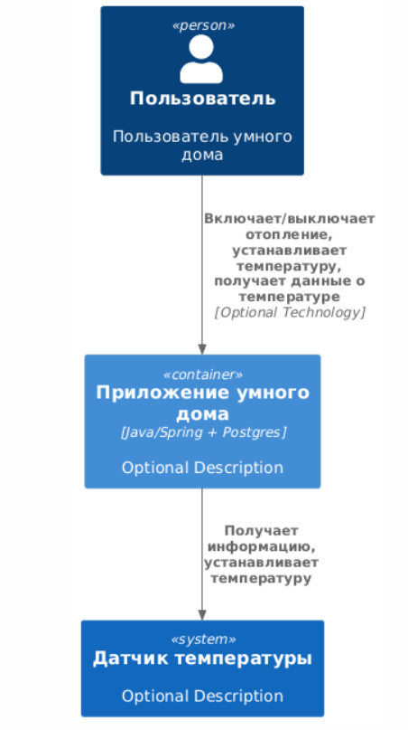
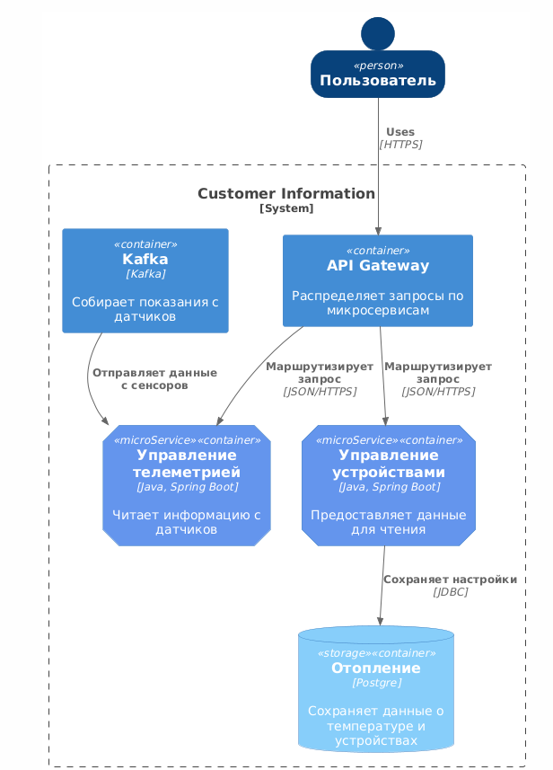
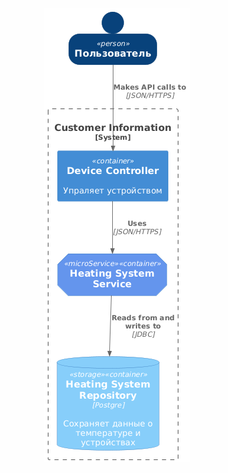
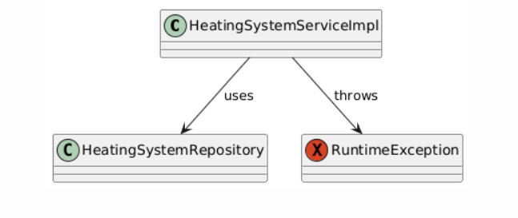
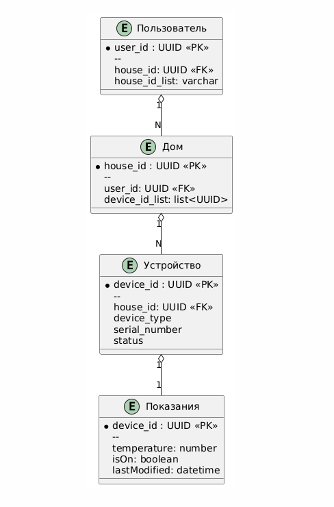
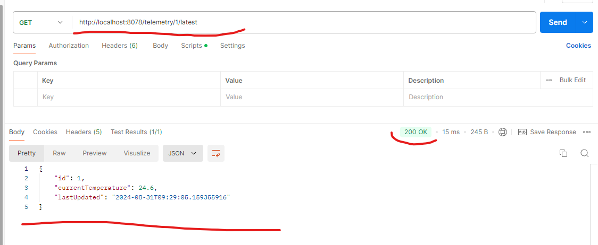
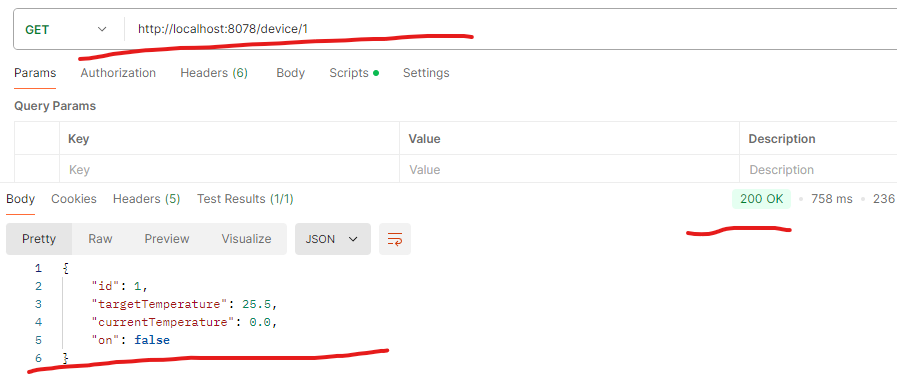

## Подзадание 1.1: Анализ и планирование

## Анализ приложения
Приложение представляет из себя монолит, которое взаимодействует с пользователями и с датчиками температуры в доме. Позволяет пользователям включать/выключать обогрев, считывать температуру и устанавливать желаемую температуру.
Язык програмирования - Java/Spring Boot
База данных - PostgreSQL
Приложение взаимодействует со своими компонентами синхронно по REST

На основании анализа можно выделить следующие границы контекстов:
1) Управление телеметрией
2) Управление устройствами
3) Пользователи
4) Управление домом

### C4 System Context Diagram для монолита

@startuml C4_Elements
!include https://raw.githubusercontent.com/plantuml-stdlib/C4-PlantUML/master/C4_Container.puml

Person(personAlias, "Пользователь", "Пользователь умного дома")
Container(containerAlias, "Приложение умного дома", "Java/Spring + Postgres", "Optional Description")
System(systemAlias, "Датчик температуры", "Optional Description")

Rel(personAlias, containerAlias, "Включает/выключает отопление, устанавливает температуру, получает данные о температуре", "Optional Technology")
Rel(containerAlias, systemAlias, "Получает информацию, устанавливает температуру")
@enduml



## Подзадание 1.2: Архитектура микросервисов

### Разбиение монолита на микросервисы

В соответствии с выделенными доменами, границами контекстов и бизнес-целями предлагается разделить монолит на следующие микросервисы:
1) Микросервис «Управление телеметрией» - Ответственен за приём, обработку и хранение данных телеметрии от устройств.
2) Микросервис «Управление устройствами» - Отвечает за регистрацию новых устройств, управление их состоянием (вкл/выкл) и отправку команд.


## С4 диаргамма уровень контейнеров

@startuml "messagebus"
!include https://raw.githubusercontent.com/plantuml-stdlib/C4-PlantUML/master/C4_Container.puml
' uncomment the following line and comment the first to use locally
' !include C4_Container.puml

AddElementTag("microService", $shape=EightSidedShape(), $bgColor="CornflowerBlue", $fontColor="white", $legendText="micro service\neight sided")
AddElementTag("storage", $shape=RoundedBoxShape(), $bgColor="lightSkyBlue", $fontColor="white")

SHOW_PERSON_OUTLINE()

Person(customer, Пользователь, "")

System_Boundary(c1, "Customer Information") {
Container(app, "API Gateway", "", "Распределяет запросы по микросервисам")
Container(message_bus, "Kafka", "Kafka", "Собирает показания с датчиков")
Container(telemetry_service, "Управление телеметрией", "Java, Spring Boot", "Читает информацию с датчиков", $tags = "microService")
Container(device_service, "Управление устройствами", "Java, Spring Boot", "Предоставляет данные для чтения", $tags = "microService")
ContainerDb(customer_db, "Отопление", "Postgre", "Сохраняет данные о температуре и устройствах", $tags = "storage")


Rel_D(customer, app, "Uses", "HTTPS")


Rel_D(app, telemetry_service, "Маршрутизирует запрос", "JSON/HTTPS")
Rel_D(app, device_service, "Маршрутизирует запрос", "JSON/HTTPS")

Rel_D(device_service, customer_db, "Сохраняет настройки", "JDBC")

Rel(message_bus, telemetry_service, "Отправляет данные с сенсоров")


Lay_R(telemetry_service, device_service)

@enduml



## C4 уровень компонентов
Диаграмма уровня компонентов описывает компоненты приложения device. Приложение имеет контроллер, сервис и репозиторий.

@startuml "messagebus"
!include https://raw.githubusercontent.com/plantuml-stdlib/C4-PlantUML/master/C4_Container.puml
' uncomment the following line and comment the first to use locally
' !include C4_Container.puml

AddElementTag("microService", $shape=EightSidedShape(), $bgColor="CornflowerBlue", $fontColor="white", $legendText="micro service\neight sided")
AddElementTag("storage", $shape=RoundedBoxShape(), $bgColor="lightSkyBlue", $fontColor="white")

SHOW_PERSON_OUTLINE()

Person(customer, Пользователь, "")

System_Boundary(c1, "Customer Information") {
Container(app, "Device Controller", "", "Упраляет устройством")
Container(device_service, "Heating System Service", $tags = "microService")
ContainerDb(customer_db, "Heating System Repository", "Postgre", "Сохраняет данные о температуре и устройствах", $tags = "storage")

Rel_D(customer, app, "Makes API calls to", "JSON/HTTPS")

Rel_D(app, device_service, "Uses", "JSON/HTTPS")

Rel_D(device_service, customer_db, "Reads from and writes to", "JDBC")

@enduml



### C4 уровень кода

@startuml


class HeatingSystemServiceImpl {
}

class HeatingSystemRepository {

}

exception RuntimeException {
}


HeatingSystemServiceImpl --> HeatingSystemRepository : uses

HeatingSystemServiceImpl --> RuntimeException : throws

@enduml



## Подзадание 1.3: ER-диаграмма

### ER-диаграмма

@startuml


entity Дом {
* house_id : UUID <<PK>>
  --
  user_id: UUID <<FK>>
  device_id_list: list<UUID>
  }

entity Устройство {
* device_id : UUID <<PK>>
  --
  house_id: UUID <<FK>>
  device_type
  serial_number
  status
  }

entity Пользователь {
* user_id : UUID <<PK>>
  --
  house_id: UUID <<FK>>
  house_id_list: varchar
  }

entity Показания {
* device_id : UUID <<PK>>
  --
  temperature: number
  isOn: boolean
  lastModified: datetime
  }

Пользователь "1" o-- "N" Дом

Дом "1" o-- "N" Устройство


Устройство "1" o-- "1" Показания

@enduml



### Обьяснение диаграммы

Каждый пользователь умного дома обладает 1 или более домов, в то время как каждый дом обладает 1 или более устройствами.
Кажое устройство имеет запись в отдельной таблице с показаниями (температура, включено, последняя модификация)


## Подзадание 1.4: Создание и документирование API
Документацию OpenAPI можно найти по [ссылке](open-api/openapi.yaml)

## Подзадание 2.1: Новые микросервисы и интеграция с монолитом

В папке smart-home-microservices созданы 2 микросервиса которые являются продуктом разбивки монолита.
Чтобы запустить эти сервисы необходим кластер kubernetes (minikube для кокального развертывания) а так же развернуть postgres и API GATEWAY kusk

Инструкция:

#### Запуск minikube

[Инструкция по установке](https://minikube.sigs.k8s.io/docs/start/)

```bash
minikube start
```

#### Импорт Helm чартов

```bash
cd ./charts
helm install smart-home .\smart-home-microservices\ 
```

#### Установка API GW kusk

[Install Kusk CLI](https://docs.kusk.io/getting-started/install-kusk-cli)

```bash
kusk cluster install
```

#### Настройка API GW

```bash
kusk deploy -i api.yaml 
```
api.yaml нужно использовать по [ссылке](open-api/openapi-for-kusk.yaml)

далее необходимо настроить порты:
kubectl port-forward svc/kusk-gateway-envoy-fleet -n kusk-system 8080:80

#### Настройка Kafka
Создаём топик:
kubectl exec --stdin --tty {KAFKA_POD} -- /bin/bash
kafka-topics --create --bootstrap-server localhost:29092 --replication-factor 1 --partitions 1 --topic telemetry

#### Проверка 

```bash
curl http://localhost:8080/telemetry/1/latest
curl http://localhost:8080/device/1
```

