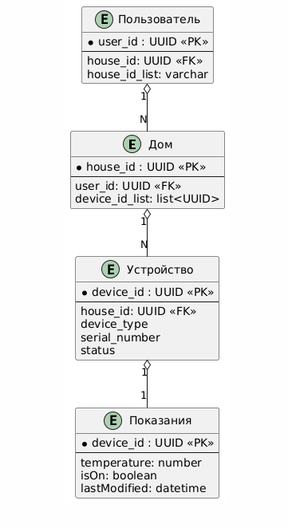

## ER-диаграмма 

@startuml

entity Дом {
* house_id : UUID <<PK>>
  --
  user_id: UUID <<FK>>
  device_id_list: list<UUID>
  }

entity Устройство {
* device_id : UUID <<PK>>
  --
  house_id: UUID <<FK>>
  device_type
  serial_number
  status
  }

entity Пользователь {
* user_id : UUID <<PK>>
  --
  house_id: UUID <<FK>>
  house_id_list: varchar
  }

entity Показания {
* device_id : UUID <<PK>>
  --
  temperature: number
  isOn: boolean
  lastModified: datetime
  }

Пользователь "1" o-- "N" Дом

Дом "1" o-- "N" Устройство

Устройство "1" o-- "1" Показания

@enduml

## Обьяснение диаграммы

Каждый пользователь умного дома обладает 1 или более домов, в то время как каждый дом обладает 1 или более устройствами.
Кажое устройство имеет запись в отдельной таблице с показаниями (температура, включено, последняя модификация)