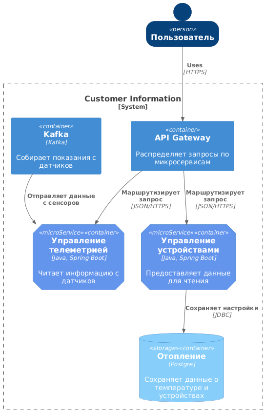
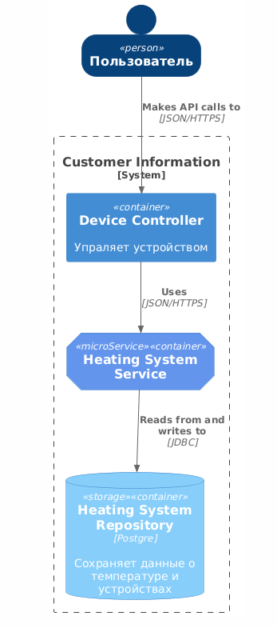

## Разбиение монолита на микросервисы

В соответствии с выделенными доменами, границами контекстов и бизнес-целями предлагается разделить монолит на следующие микросервисы:
1) Микросервис «Управление телеметрией» - Ответственен за приём, обработку и хранение данных телеметрии от устройств.
2) Микросервис «Управление устройствами» - Отвечает за регистрацию новых устройств, управление их состоянием (вкл/выкл) и отправку команд.

## С4 диаргамма уровень контейнеров

@startuml "messagebus"
!include https://raw.githubusercontent.com/plantuml-stdlib/C4-PlantUML/master/C4_Container.puml
' uncomment the following line and comment the first to use locally
' !include C4_Container.puml

AddElementTag("microService", $shape=EightSidedShape(), $bgColor="CornflowerBlue", $fontColor="white", $legendText="micro service\neight sided")
AddElementTag("storage", $shape=RoundedBoxShape(), $bgColor="lightSkyBlue", $fontColor="white")

SHOW_PERSON_OUTLINE()

Person(customer, Пользователь, "")

System_Boundary(c1, "Customer Information") {
Container(app, "API Gateway", "", "Распределяет запросы по микросервисам")
Container(message_bus, "Kafka", "Kafka", "Собирает показания с датчиков")
Container(telemetry_service, "Управление телеметрией", "Java, Spring Boot", "Читает информацию с датчиков", $tags = "microService")
Container(device_service, "Управление устройствами", "Java, Spring Boot", "Предоставляет данные для чтения", $tags = "microService")
ContainerDb(customer_db, "Отопление", "Postgre", "Сохраняет данные о температуре и устройствах", $tags = "storage")

Rel_D(customer, app, "Uses", "HTTPS")

Rel_D(app, telemetry_service, "Маршрутизирует запрос", "JSON/HTTPS")
Rel_D(app, device_service, "Маршрутизирует запрос", "JSON/HTTPS")

Rel_D(device_service, customer_db, "Сохраняет настройки", "JDBC")

Rel(message_bus, telemetry_service, "Отправляет данные с сенсоров")

Lay_R(telemetry_service, device_service)

@enduml

## C4 уровень компонентов
Диаграмма уровня компонентов описывает компоненты приложения device. Приложение имеет контроллер, сервис и репозиторий.

@startuml "messagebus"
!include https://raw.githubusercontent.com/plantuml-stdlib/C4-PlantUML/master/C4_Container.puml
' uncomment the following line and comment the first to use locally
' !include C4_Container.puml

AddElementTag("microService", $shape=EightSidedShape(), $bgColor="CornflowerBlue", $fontColor="white", $legendText="micro service\neight sided")
AddElementTag("storage", $shape=RoundedBoxShape(), $bgColor="lightSkyBlue", $fontColor="white")

SHOW_PERSON_OUTLINE()

Person(customer, Пользователь, "")

System_Boundary(c1, "Customer Information") {
Container(app, "Device Controller", "", "Упраляет устройством")
Container(device_service, "Heating System Service", $tags = "microService")
ContainerDb(customer_db, "Heating System Repository", "Postgre", "Сохраняет данные о температуре и устройствах", $tags = "storage")

Rel_D(customer, app, "Makes API calls to", "JSON/HTTPS")

Rel_D(app, device_service, "Uses", "JSON/HTTPS")

Rel_D(device_service, customer_db, "Reads from and writes to", "JDBC")

@enduml

