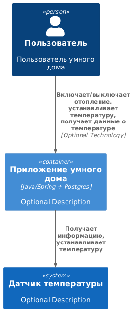

# Smart Home Monolith

## Описание

Проект "Smart Home Monolith" представляет собой монолитное приложение для управления отоплением и мониторинга температуры в умном доме. Пользователи
могут удаленно включать/выключать отопление, устанавливать желаемую температуру и просматривать текущую температуру через веб-интерфейс.

## Структура проекта

Проект организован в соответствии со стандартной структурой Maven/Gradle проекта:

- **Основной класс приложения** аннотирован `@SpringBootApplication`.
- **Пакеты**:
    - `controller` - контроллеры для обработки HTTP-запросов.
    - `service` - сервисы для бизнес-логики.
    - `repository` - репозитории для доступа к базе данных.
    - `entity` - сущности JPA.
    - `dto` - объекты передачи данных (DTO).

## Зависимости

Проект использует следующие зависимости:

- Java 17
- Maven >=3.8.1 && <4.0.0
- `spring-boot-starter-web` - для создания веб-приложений.
- `spring-boot-starter-data-jpa` - для работы с JPA и базой данных.
- `postgresql` - драйвер для работы с PostgreSQL.
- `springfox-boot-starter` - для интеграции Swagger.
- `lombok` - для упрощения написания кода.
- `spring-boot-starter-test`, `spring-boot-testcontainers`, `junit-jupiter`, `testcontainers` - для тестирования.

## Запуск

1.

``` shell
docker run --name postgres-db -e POSTGRES_DB=smart_home -e POSTGRES_USER=your_username -e POSTGRES_PASSWORD=your_password -p 5432:5432 -d postgres:13-alpine
```

2.

``` shell
mvn spring-boot:run
```

## Тесты

``` shell
mvn test
```

## Конфигурация

### Подключение к базе данных

Конфигурация подключения к PostgreSQL находится в файле `application.yml`:

```yaml
spring:
  datasource:
    url: jdbc:postgresql://localhost:5432/smart_home
    username: user
    password: password
  jpa:
    hibernate:
      ddl-auto: update
    show-sql: true
```

## Логирование

В проекте используется SLF4J для логирования.

## Тестирование

В проекте написаны модульные тесты для сервисов и контроллеров.

## C4 System Context Diagram

@startuml C4_Elements
!include https://raw.githubusercontent.com/plantuml-stdlib/C4-PlantUML/master/C4_Container.puml

Person(personAlias, "Пользователь", "Пользователь умного дома")
Container(containerAlias, "Приложение умного дома", "Java/Spring + Postgres", "Optional Description")
System(systemAlias, "Датчик температуры", "Optional Description")

Rel(personAlias, containerAlias, "Включает/выключает отопление, устанавливает температуру, получает данные о температуре", "Optional Technology")
Rel(containerAlias, systemAlias, "Получает информацию, устанавливает температуру")
@enduml



## Анализ приложения
Приложение представляет из себя монолит, которое взаимодействует с пользователями и с датчиками температуры в доме. Позволяет пользователям включать/выключать обогрев, считывать температуру и устанавливать желаемую температуру.
Язык програмирования - Java/Spring Boot
База данных - PostgreSQL
Приложение взаимодействует со своими компонентами синхронно по REST

На основании анализа можно выделить следующие границы контекстов:
1) Управление телеметрией
2) Управление устройствами
3) Пользователи
4) Управление домом